# AI Character Assistant 🦊

A cute, interactive AI companion that lives on your desktop. Foxy (or your custom character) floats above your windows, reacts to your clicks, and chats with you using Google's Gemini AI.

---

## 🌟 Features

- **Always on Top**: Floats over other windows.
- **Click-Through**: Only interactive parts (character, chat bubble) capture mouse events; the rest lets you click through to your work.
- **Interactive**: Reacts to clicks, drag-and-drop, and conversations.
- **AI Powered**: Integrated with Google Gemini for personality-driven chat.
- **Customizable**: Change themes, names, and personality traits.
- **Linux Native**: Direct integration with Linux input subsystems for global cursor tracking and shortcuts, even on Wayland.
- **Wiggle Detection**: Move your mouse quickly over the character and it will scurry away! 🏃

---

## 🛠️ Usage
    
### Prerequisites
- **Linux Users**: You must be in the `input` group to allow the app to read mouse events.
    ```bash
    sudo usermod -a -G input $USER
    # You must LOG OUT and LOG IN again for this to take effect!
    ```
    > **Note:** On Wayland compositors (e.g. Pantheon/Gala, GNOME), the app automatically falls back to XWayland mode for reliable "always on top" behavior.

### Shortcuts
- **`Meta + Shift + F`** (Super+Shift+F): **Toggle Chat**. Show/Hide the chat window.
- **`Meta + Shift + D`** (Super+Shift+D): **Toggle Drag Mode**. 
    - **ON**: Window becomes opaque and clickable everywhere. You can drag Foxy to a new spot.
    - **OFF**: Window becomes "ghostly" again (clicks pass through except on Foxy).
- **`Meta + Shift + S`** (Super+Shift+S): **Screensaver Mode**. Full-screen character wanders around.
- **`Meta + Shift + C`** (Super+Shift+C): **Center Character**. Moves the character to the center of the screen. Useful if it gets lost off-screen!

### Installation & Development
1.  **Install Dependencies**:
    ```bash
    npm install
    ```

2.  **Run in Dev Mode**:
    ```bash
    npm run tauri:dev
    ```

3.  **Build for Production**:
    ```bash
    npm run tauri:build
    ```
    *(Note: This generates installable `.deb` and `.AppImage` files in `src-tauri/target/release/bundle/`)*

---

## 🏗️ Architecture

The project is built with **Tauri** (Rust backend), **TypeScript** frontend, and **Vite** for bundling.

### High-Level Architecture

```
┌─────────────────────────────────────────────────────────────────┐
│                         USER INTERACTION                        │
│  (Clicks, drags, keyboard shortcuts, mouse wiggling)            │
└───────────────────────────┬─────────────────────────────────────┘
                            │
        ┌───────────────────┴───────────────────┐
        │                                       │
        ▼                                       ▼
┌──────────────────┐                  ┌──────────────────┐
│   OS Input       │                  │   Tauri Window   │
│   (Rust Backend) │                  │   (TypeScript)   │
│                  │  ◄──Events───    │                  │
│  • /dev/input    │  ──Events──►     │  • Character     │
│  • Win32 Raw     │                  │  • Chat Bubble   │
│    Input API     │                  │  • Settings UI   │
│  • Global cursor │                  │                  │
│  • Shortcuts     │                  │                  │
└──────────────────┘                  └──────────────────┘
        │                                       │
        │                                       │
        ▼                                       ▼
┌──────────────────┐                  ┌──────────────────┐
│  Shared State    │                  │  Google Gemini   │
│ (Arc<Mutex>)     │                  │  AI Service      │
│                  │                  │                  │
│  • cursor_x/y    │                  │  • Chat API      │
│  • modifiers     │                  │  • Responses     │
│  • shortcuts     │                  │                  │
└──────────────────┘                  └──────────────────┘
```

### Directory Structure

```
├── src-tauri/              # Rust Backend (Tauri)
│   ├── src/
│   │   ├── main.rs         # App entry point, IPC commands, thread spawning
│   │   ├── lib.rs          # Library entry (minimal)
│   │   ├── shared.rs       # Shared types (KeyCode, InputState, OutputEvent)
│   │   └── input/          # OS-specific input handling
│   │       ├── mod.rs      # Generic interface (dispatches to OS backend)
│   │       ├── linux.rs    # Linux implementation (evdev, X11)
│   │       └── windows.rs  # Windows implementation (Win32 Raw Input)
│   └── tauri.conf.json     # App configuration
│
└── src/renderer/           # Frontend Process (Web/UI)
    ├── index.html          # Main HTML template
    ├── app.ts              # Entry Point - initializes all modules
    ├── style.css           # Global styles
    ├── modules/            # Feature Modules
    │   ├── store.ts        # Global state management
    │   ├── character.ts    # Character visuals, dragging, animations
    │   ├── chat.ts         # Chat bubble & input logic
    │   ├── interactions.ts # Click-through logic
    │   ├── settings.ts     # Settings panel UI
    │   ├── lighting.ts     # Day/night lighting effects
    │   └── screensaver.ts  # Screensaver mode
    └── services/
        └── gemini.ts       # Google Gemini AI API client
```

---

## 🔄 Application Flow

### 1. Startup Flow

```mermaid
graph TD
    A[User Starts App] --> B[main.rs: main]
    B --> C[Detect Screen Size]
    C --> D[Create Shared State]
    D --> E[Spawn Input Thread]
    E --> F[Setup Window Properties]
    F --> G[Start Tauri Event Loop]
    
    G --> H[app.ts: init]
    H --> I[Load Config]
    I --> J[Initialize Modules]
    J --> K[Apply Config]
    K --> L[Listen for Backend Events]
    L --> M[App Ready! 🎉]
```



#### 1.1. Backend Initialization (`main.rs`)
- **Entry Point**: `main()` function
- **Steps**:
  1. Build Tauri app with plugins (global shortcuts, logging)
  2. Register IPC command handlers (`save_config`, `load_config`, etc.)
  3. In `setup()`:
     - Detect screen resolution via `input::detect_screen_size()`
     - Create `Arc<SharedState>` for thread-safe communication
     - Spawn background input monitoring thread
     - Set window to "always on top"

#### 1.2. Frontend Initialization (`app.ts`)
- **Entry Point**: `init()` function (called on `DOMContentLoaded`)
- **Steps**:
  1. Clear previous shortcuts (dev mode safety)
  2. Load config from backend via `invoke('load_config')`
  3. Initialize modules in order:
     - `setupClickThrough()` - Click-through regions
     - `initCharacter()` - Character animations
     - `initChat()` - Chat system
     - `initSettings()` - Settings panel
     - `initLighting()` - Day/night effects
     - `initScreensaver()` - Screensaver mode
  4. Apply loaded configuration
  5. Set up event listeners for backend events
  6. Register `beforeunload` handler to save window position on close

---

### 2. Input Monitoring Flow (Background Thread)


#### 2.1. Linux Backend (`input/linux.rs`)
- **Device Discovery**: Scans `/dev/input/event*` for mice and keyboards
- **Event Loop**: Uses `select()` to poll multiple devices efficiently
- **Cursor Tracking**: Accumulates relative mouse movements
- **Shortcuts**: Detects `Meta+Shift+F/D/S/C` combinations
- **Fullscreen Detection**: Queries X11 window properties

#### 2.2. Windows Backend (`input/windows.rs`)
- **Raw Input API**: Creates hidden window and registers for `WM_INPUT` messages
- **Message Loop**: Processes Windows messages in dedicated thread
- **Cursor Tracking**: Uses `GetCursorPos()` for absolute positions
- **Shortcuts**: Maps `VK_*` virtual key codes to `KeyCode`

---

### 3. User Interaction Flows

#### 3.1. Clicking the Character


#### 3.2. Sending a Chat Message


#### 3.3. Mouse Wiggle Detection


---

## 📂 Entry Points & Key Files

### Backend (Rust)

| File | Purpose | Key Functions/Exports |
|------|---------|----------------------|
| **`main.rs`** | Application entry point | `main()`, `save_config()`, `load_config()`, `check_fullscreen()` |
| **`shared.rs`** | Shared data types | `KeyCode`, `InputState`, `OutputEvent`, `SharedState` |
| **`input/mod.rs`** | OS-agnostic input interface | `detect_screen_size()`, `check_fullscreen()`, `run_input_loop()` |
| **`input/linux.rs`** | Linux input implementation | `discover_devices()`, `process_device_events()`, `run_input_loop()` |
| **`input/windows.rs`** | Windows input implementation | `wnd_proc()`, `map_vkey()`, `run_input_loop()` |

### Frontend (TypeScript)

| File | Purpose | Key Functions/Exports |
|------|---------|----------------------|
| **`app.ts`** | Frontend entry point | `init()` - orchestrates all module initialization |
| **`modules/store.ts`** | Global state management | `state`, `CharacterState`, `on()`, `emit()` |
| **`modules/character.ts`** | Character interactions | `initCharacter()`, `setState()`, `toggleDragMode()`, `moveToRandomLocation()` |
| **`modules/chat.ts`** | Chat system | `initChat()`, `showSpeechBubble()`, `typeText()`, `sendMessage()` |
| **`modules/interactions.ts`** | Click-through logic | `setupClickThrough()`, `updateInteractiveState()` |
| **`modules/settings.ts`** | Settings UI | `initSettings()`, `applyConfig()`, `saveSettings()` |
| **`modules/screensaver.ts`** | Screensaver mode | `initScreensaver()`, `toggleScreensaver()` |
| **`services/gemini.ts`** | AI integration | `generateResponse()`, `GeminiService` class |

---

## 🧠 Key Technical Decisions

### Why Rust Backend for Input?
**Problem**: On Wayland, web apps cannot access global cursor position or detect shortcuts when unfocused.

**Solution**: Rust backend reads raw input directly from `/dev/input` (Linux) or Win32 Raw Input API (Windows), bypassing Wayland's security restrictions.

### Why Arc<Mutex<InputState>>?
The input monitoring thread and main Tauri thread need to share cursor position and modifier state. `Arc` allows shared ownership across threads, and `Mutex` ensures thread-safe access.

### Why Separate OS Modules?
- **Maintainability**: Linux and Windows have completely different input APIs
- **Compile-time selection**: Only the relevant module compiles for each platform
- **Extensibility**: Easy to add macOS support later

### Why Not Store Speech Bubble State in `AppState`?
The speech bubble visibility is managed directly via DOM class (`hidden`). We added `isSpeechBubbleVisible()` as a helper to check this state, avoiding unnecessary state duplication.

---

## 🐧 Linux / Wayland Compatibility

### The Challenge
- **Wayland Security**: Apps cannot see global cursor or detect shortcuts when unfocused
- **Click-Through**: Standard windowing APIs fail for overlay apps
- **Always on Top**: Wayland compositors silently ignore `set_always_on_top()` — it's not part of the Wayland protocol

### Our Solution
1. **Raw Input Reading**: `/dev/input/event*` for global cursor tracking and shortcuts
2. **Always-on-Top Strategy**: On Wayland sessions, the app automatically forces `GDK_BACKEND=x11` (XWayland) where `set_always_on_top` works reliably
3. **Shortcut Detection**: Detect `Meta+Shift+F/D/S/C` globally via `/dev/input`
4. **Event Emission**: Send events to frontend via Tauri IPC

---

## 💻 Developer Guide

### Quick Start Commands
```bash
# Development (hot-reload, auto-sets GDK_BACKEND=x11 on Linux)
npm run tauri:dev

# Production build (auto-sets GDK_BACKEND=x11 on Linux)
npm run tauri:build

# TypeScript type check
npx tsc --noEmit

# Rust check
cd src-tauri && cargo check
```

### Debugging Tips
1. **Console Logs**: Check terminal for both Rust (`println!`) and TypeScript (`console.log`)
2. **Debug Mode**: Settings → Enable Debug Mode to see UI element borders
3. **Inspect Window**: Right-click → Inspect (DevTools only available in dev mode)
4. **Input Events**: Watch for `[Input]` prefixed logs in terminal

### Adding a New Shortcut
1. **Backend** (`shared.rs`): Add `KeyCode` variant if needed
2. **Backend** (`input/*/rs`): Map native key to `KeyCode`
3. **Backend** (`shared.rs`): Add shortcut check in `check_shortcut()`
4. **Frontend** (`app.ts`): Add handler in `listen('shortcut')` listener
5. **Frontend** (`store.ts`): Add to `defaultShortcuts`

### Initial Setup for Users
1. Click the **Backpack Icon** 🎒 (appears on hover) to open Settings
2. Enter your **Google Gemini API Key**
3. Click **Save**. Foxy is now ready to chat!

### Custom Character Themes

You can customize the character by adding your own images:

1.  **Create Theme Folder**: Navigate to your configuration directory:
    - **Linux**: `~/.config/com.sam.ai-character-assistant/themes/`
    - **Windows**: `%APPDATA%\com.sam.ai-character-assistant\themes\`
    
    Create a new folder (e.g., `my_char`).

2.  **Add Images**: Place your PNG images inside this folder with the following names:
    - `idle.png` (Default state)
    - `talking.png` (When speaking)
    - `listening.png` (When you are typing)
    - `clicked.png` (When clicked)

3.  **Activate**: Restart the app or open **Settings** -> **Character Theme** and select your new theme (marked with 📂).

---

---

## 🚀 Release Process

### Option 1: Automated Release (Recommended)

To release a new version (e.g., `1.0.1`):

1.  **Run the release command**:
    ```bash
    npm run release 1.0.1
    ```
    This command runs a helper script that will:
    -   **Sync Versions**: Updates `package.json`, `tauri.conf.json`, and `Cargo.toml` to `1.0.1`.
    -   **Commit**: Creates a commit "chore: release v1.0.1".
    -   **Tag**: Creates a git tag `v1.0.1`.
    -   **Push**: Pushes code and tags to GitHub.

2.  **Wait**: GitHub Actions will detect the new tag, build:
    -   **Linux**: `.deb` (Debian/Ubuntu), `.rpm` (Fedora/OpenSUSE), `.AppImage` (Arch/All)
    -   **Windows**: `.exe` and `.msi`
    and publish them as a GitHub Release.

### Option 2: Manual Local Build

If you want to build and upload manually without pushing to GitHub:

1.  **Build & Release**:
    ```bash
    ./scripts/manual_release.sh
    ```
    *(Note: You must have `gh` CLI installed and authenticated)*

---

## 📜 License

MIT

---

## 🦊 Credits

Created with love by Sam. Character design and concept inspired by desktop companion applications.

Powered by:
- [Tauri](https://tauri.app/) - Rust-powered desktop framework
- [Google Gemini](https://ai.google.dev/) - AI chat integration
- [evdev](https://gitlab.freedesktop.org/libevdev/libevdev) (Linux) - Input device library
- [Win32 API](https://learn.microsoft.com/en-us/windows/win32/) (Windows) - Windows input handling
